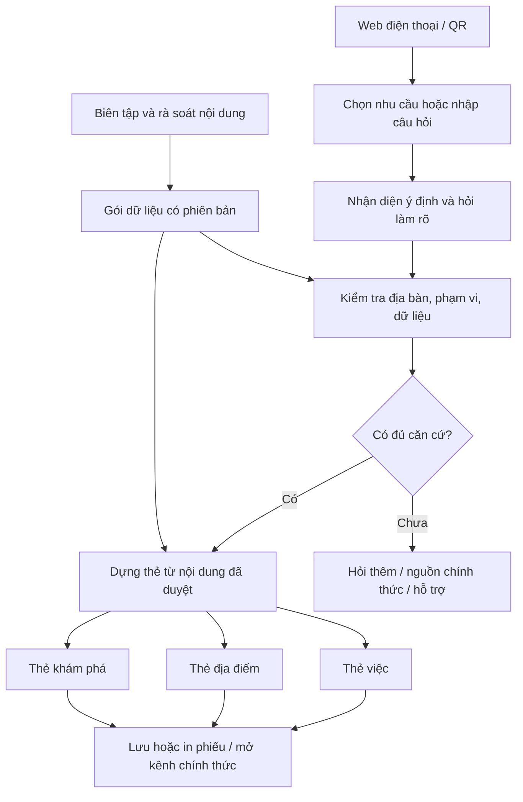

# Kiến trúc LC Compass — bản chốt để xây prototype

## Bàn giao triển khai

Bộ giao việc cho Antigravity nằm tại [START_HERE](../../docs/handoff/START_HERE.md); hợp đồng triển khai ở [CONTRACTS](../../docs/handoff/CONTRACTS.md). Vercel Root Directory là `web`. Google Search/Gemini theo chế độ kết hợp: thẻ đã rà soát phục vụ tác vụ chính, tìm thêm nguồn trực tiếp có nhãn tham khảo riêng.

Yêu cầu UI bổ sung của người dùng: **mobile-first, chiều rộng responsive dùng %**. Chi tiết và tiêu chí nghiệm thu tại [MOBILE_FIRST](../decisions/MOBILE_FIRST.md). Tài liệu bàn giao cụ thể hóa kiến trúc; không có nghĩa ứng dụng đã được code/deploy.

## 1. Một lõi, ba loại thẻ

AI, nếu được bật, chỉ đề xuất intent_id và câu hỏi làm rõ trong danh sách cho phép. Người dùng xác nhận khi mơ hồ. Quy tắc và renderer quyết định thẻ được xuất. Không cho mô hình tự chế thủ tục, chọn thẩm quyền, đặt phí, kết luận điều kiện hoặc tạo đường dẫn.

Với nội dung hữu hạn, bản đầu dùng HTML/CSS/JavaScript hoặc giao diện web tương đương và JSON có phiên bản. Chưa cần vector database, orchestration nhiều agent, tài khoản người dân hay bộ nhớ hội thoại trên máy chủ. Lựa chọn công nghệ cụ thể có thể thay đổi mà không đổi schema/thỏa thuận đầu ra.

## 2. Hợp đồng dữ liệu dùng chung

Mỗi thẻ bắt buộc có:

| Nhóm | Trường chính | Quy tắc |
|---|---|---|
| Định danh | id, version, type, title, intent_ids | ID ổn định; version mới khi nội dung đổi |
| Phạm vi | jurisdiction_id, jurisdiction_label, applicability, exclusions | Không suy ra phường từ tên quận cũ hoặc đường dài xuyên nhiều phường |
| Nguồn | source_url, publisher, source_title, relevant_excerpt, source_date, fetched_at | Tách ngày nguồn và ngày truy cập; tên miền chính thức chưa đủ để kết luận nội dung hiện hành |
| Rà soát | content_owner, reviewer, reviewed_at, review_due, status | Draft/review/published/withdrawn; chỉ published và còn hạn được xuất chi tiết |
| Nội dung | facts, unknowns, questions, steps, claims_with_sources | Điều chưa rõ phải hiện rõ; mỗi khẳng định quan trọng nối tới nguồn hỗ trợ |
| Hành động | action_type, approved_url, public_contact, fallback | Link/đầu mối lấy từ allowlist đã rà soát; không do AI tự tạo |
| Đánh giá | critical_claims, fixture_ids, revision_reason | Có ca kiểm tra khi thay đổi dữ liệu |

Thẻ PLACE bổ sung chức năng phục vụ, địa chỉ văn bản, tọa độ khi đã xác minh, nguồn xác nhận địa điểm. Giờ mở cửa là trường tùy chọn có ngày kiểm tra riêng. “Không rõ giờ” là giá trị hợp lệ. Tọa độ một tòa nhà không chứng minh đó là nơi tiếp nhận đúng việc.

Thẻ DISCOVER bổ sung tác giả/nguồn câu chuyện, thông tin quyền sử dụng hình ảnh, trong/ngoài phạm vi. Không tạo sao, số review, giá, thời gian di chuyển. Muốn thêm sự kiện phải có start/end/timezone và quy tắc ẩn khi hết hạn, nhưng MVP chưa làm.

Thẻ SERVICE chứa đồ thị bước có điều kiện, không phải đoạn văn để AI nối tùy ý. Mỗi điều kiện có lựa chọn **không biết**. Mọi thao tác phát sinh bên ngoài do người dân thực hiện trên dịch vụ chính thức.

## 3. Quy tắc định tuyến và giới hạn mô hình hiện tại

Ưu tiên xử lý: nguy cơ tức thời → bỏ đầu vào nhạy cảm → làm rõ địa bàn → ngoài địa bàn → ngoài nội dung hỗ trợ → giới hạn cá nhân hóa → nguồn quá hạn/mâu thuẫn → mất mạng → thiếu điều kiện → hỗ trợ đọc hiểu → hiển thị thẻ.

Trong mã mô phỏng, PREPARE là tên nội bộ của nhánh **đủ điều kiện hiển thị thẻ theo fixture**, không có nghĩa hồ sơ thật đủ điều kiện nộp.

Hai nguyên tắc vượt mọi nhánh: không gửi dữ liệu nhạy cảm ra dịch vụ ngoài; không giả mạo việc đã giao tiếp với cơ quan. Ưu tiên màn hình khẩn không làm mất nguyên tắc về dữ liệu.

Mô hình dùng metadata được gắn sẵn, chưa xử lý NLP hoặc giấy tờ thật. Những thành phần sản phẩm còn phải hiện thực: phát hiện dữ liệu nhạy cảm trước khi gọi AI, xác định đúng địa bàn, theo dõi hạn nội dung, kiểm tra link, renderer, lưu/xóa phiên, accessibility. Những ca người dùng không báo mình đang gặp nguy cơ không nằm trong khả năng phát hiện đã được kiểm chứng.

## 4. AI là tùy chọn có giới hạn

Nếu bật AI: một endpoint phía máy chủ, khóa API không nằm trên trình duyệt. Đầu vào đã được tối thiểu hóa; đầu ra theo schema gồm intent đề xuất, điều còn thiếu và card_id trong allowlist. Nếu đầu ra sai schema, timeout, không đủ căn cứ hoặc hết hạn mức, trở lại chọn bằng nút.

Không tin con số confidence do LLM tự khai để quyết định thủ tục. Câu hỏi có nhiều ý định phải cho người dùng chọn việc làm trước; không ghép thành kế hoạch mới tự phát. Văn bản nguồn được coi là dữ liệu, không được phép thay đổi chỉ dẫn của hệ thống.

Ngôn ngữ giải thích có thể diễn đạt mềm hơn, nhưng danh sách bước, nguồn, cơ quan và hành động không thay đổi theo văn phong. MVP có thể bỏ hoàn toàn phần sinh giải thích nếu chưa kiểm tra được.

## 5. Từ tìm thông tin tới làm tiếp

Trạng thái trong ứng dụng: chọn việc → còn câu hỏi → có phiếu chuẩn bị → người dùng tự đánh dấu phần đã chuẩn bị → mở kênh chính thức → tự báo còn vướng/đã xong.

Không có trạng thái “cơ quan đã nhận/đã duyệt” do ứng dụng tự ghi. Dữ liệu tự báo chỉ dùng nghiên cứu hỗ trợ, không trình bày như trạng thái hồ sơ chính thức.

Phiếu hỗ trợ chỉ chứa loại nhu cầu, câu hỏi chưa rõ, card_id, phiên bản, ngày rà soát và các bước người dùng tự chọn. Mặc định không chứa họ tên, số căn cước, ảnh giấy tờ, mật khẩu, OTP, số hồ sơ hoặc địa chỉ phòng trọ chính xác. Có nút xem trước khi người dùng in/chia sẻ. Không tự gửi cho đoàn viên/cán bộ.

QR mặc định chỉ mã hóa URL thẻ và phiên bản không chứa dữ liệu cá nhân; người dùng tự mở lại/đánh dấu. Không đặt dữ liệu hoàn cảnh cá nhân trong query string. Không nhận tài khoản định danh để “làm hộ”.

Thiết bị dùng chung: mặc định dữ liệu phiên ở bộ nhớ, nút xóa rõ ràng; không lưu bền theo mặc định. Trên thiết bị cá nhân, lưu phiếu phải chủ động chọn và xem được cách xóa. Offline chỉ xem bản đã lưu, hiện ngày và trạng thái không thể xác minh lại.

## 6. Vận hành dữ liệu

Vai trò đề xuất, chưa phải cam kết của cơ quan: 1 người phụ trách nội dung; 1 người rà soát nghiệp vụ phù hợp; 1 người phát triển; 1 người thử nghiệm/tiếp cận cộng đồng; 1 người hồ sơ/demo. Có thể kiêm nhiệm trong nhóm tối đa 5 người. Nếu người rà soát nghiệp vụ là bên phối hợp, ghi rõ chưa thuộc nhóm thi và chưa có đồng ý cho đến khi xác nhận.

Quy trình: thu thập nguồn → tạo bản nháp → so điều kiện áp dụng/địa bàn → người có khả năng chuyên môn rà soát → chạy ca liên quan → phát hành gói dữ liệu → nhận báo lỗi → rút thẻ bị ảnh hưởng → phát hành phiên bản mới. Tên người rà soát không được tự điền giả.

Hạn rà soát là chính sách nội bộ theo mức biến động, không phải ngày hết hiệu lực pháp lý. Link còn truy cập được không chứng minh thông tin chưa đổi. Nhận thông báo thay đổi thì rút thẻ ngay, không đợi tới lịch rà soát. Ngoài giờ chưa có người trực: hiện đầu mối tự liên hệ và trạng thái chưa xác nhận, không hứa phản hồi.

Nhân rộng bằng gói dữ liệu theo địa bàn, mẫu thẻ, bộ ca kiểm tra, hướng dẫn bàn giao và chủ sở hữu nội dung mới. Không sao chép địa chỉ/thẩm quyền của Liên Chiểu sang phường khác.

## 7. Những lỗi từ 3 ảnh trở thành yêu cầu kỹ thuật

- Nhãn “chính thống” phải dẫn tới nguồn + ngày rà soát + phạm vi áp dụng; không chỉ là biểu tượng tin cậy.
- Không lấy khoảng cách 320 m hoặc “3 phút đi bộ” trong ảnh làm dữ liệu. MVP không tính nearest; để người dùng chọn khu vực và mở bản đồ ngoài.
- Không lấy giờ mở cửa/số điện thoại trong ảnh làm đầu mối; phải xác minh từng trường.
- Bỏ “sự kiện hôm nay” nếu dữ liệu không có thời gian được xác nhận. Ngày 2024 trong ảnh là tình huống lỗi, không là lịch thật 2026.
- Không tạo lịch trình 2 giờ mà bỏ thời gian di chuyển, giờ mở cửa, thời tiết và khả năng tiếp cận.
- Địa điểm ngoài phường được gắn nhãn đúng; MVP có thể chỉ chuyển nguồn thay vì hiển thị danh bạ ngoài phạm vi.
- Các mục tin tức, phản ánh, thông báo, tài khoản và yêu thích trên ảnh không tự động trở thành yêu cầu MVP.

## 8. Kiểm chứng tiếp theo trước khi phục vụ người dân

1. Dữ liệu: từng khẳng định quan trọng phải có nguồn đủ hỗ trợ, đúng địa bàn và người rà soát được ghi nhận. Không dùng nhãn giả định clean từ mô phỏng làm chứng nhận.
2. Tác vụ: tự thao tác, có người hỗ trợ, thiếu thông tin, nguồn bị rút, AI tắt, offline, máy dùng chung. Bao gồm một chuỗi người dùng sửa lại câu trả lời trước đó.
3. Bảo mật/riêng tư: dữ liệu không xuất hiện trong log, query string, request AI ngoài phạm vi cho phép; thử xóa/khôi phục phiên và đầu vào phá chỉ dẫn.
4. So sánh người dùng: 12–20 người thử cùng tác vụ ở kênh hiện tại và prototype, đảo thứ tự để giảm hiệu ứng học; ghi lỗi, thời gian, nhu cầu hỗ trợ. Mẫu nhỏ nhằm phát hiện vấn đề, không đại diện toàn phường.
5. Kiểm tra AI riêng nếu bật: câu không dấu, sai chính tả, nhiều ý định, tên địa bàn cũ, cố ép trả lời khi thiếu nguồn. Dùng câu chưa dùng để chỉnh prompt; báo cả lỗi thay vì chỉ tỷ lệ chung.

Không làm mới toàn bộ khi gặp lỗi: rút thẻ/nhánh sai hoặc tắt AI, giữ những thẻ công khai đã duyệt. Gói dữ liệu và phiên bản trước cho phép quay lại.
