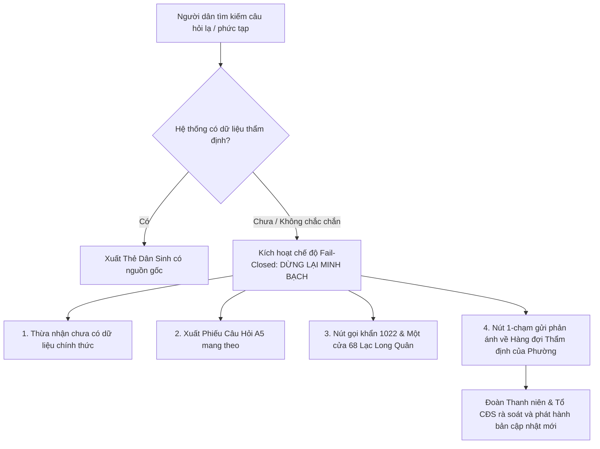

# Báo Cáo Chiến Lược: Xử Lý Đa Dạng Vùng Miền & Ứng Phó Với Điểm Biên Chưa Biết (The Unknown Unknowns)

**Mã tài liệu:** `RESEARCH-UNKNOWN-2026-09-21`  
**Dự án:** LC Compass – La bàn Liên Chiểu 2026  
**Chủ đề:** Giải quyết rào cản đa phương ngữ Bắc – Trung – Nam và thiết lập kiến trúc phòng thủ trước các tình huống dân sinh chưa từng lường trước (Unknown Unknowns).

---

## 1. BỐI CẢNH NHÂN KHẨU HỌC: TẠI SAO PHƯỜNG LIÊN CHIỂU LÀ "NỒI LẨU PHƯƠNG NGỮ"?

Nhiều dự án công nghệ chuyển đổi số cấp cơ sở thường mắc sai lầm nghiêm trọng khi giả định rằng: *"Người dân ở Đà Nẵng thì chỉ nói tiếng Đà Nẵng hoặc tiếng Việt chuẩn"*.

Thực tế khảo sát tại Phường Liên Chiểu mới (sau hợp nhất theo Nghị quyết 1659/NQ-UBTVQH15) chứng minh điều hoàn toàn ngược lại:
1. **Khu công nghiệp Hòa Khánh (40.000+ công nhân):**
   - Hơn 65% là người lao động nhập cư từ các tỉnh Bắc Trung Bộ: **Nghệ An, Hà Tĩnh, Quảng Bình, Quảng Trị** và Bắc Bộ (**Thanh Hóa**).
   - Một tỷ lệ đáng kể công nhân và thợ bậc cao đến từ các tỉnh Nam Trung Bộ (**Quảng Ngãi, Bình Định**) và một số tỉnh miền Tây Nam Bộ.
2. **Hệ thống các trường Đại học lớn (ĐH Bách khoa, Cao đẳng Kinh tế - Kế hoạch):**
   - Hơn 35.000 sinh viên từ khắp 63 tỉnh thành đổ về thuê trọ tại các xóm trọ sinh viên, mang theo toàn bộ thói quen ngôn ngữ, đại từ xưng hô và lỗi chính tả bản quán.
3. **Đồng bào dân tộc thiểu số Cơ Tu:**
   - Khu vực giáp ranh Hòa Liên, Hòa Bắc có bà con đồng bào Cơ Tu xuống làm việc hoặc giao dịch hành chính, vốn gặp rào cản rất lớn về việc tiếp cận văn bản hành chính bằng tiếng Kinh hàn lâm.

👉 **Hệ quả kỹ thuật:** Nếu chỉ chuẩn hóa tiếng Quảng Nam - Đà Nẵng (*mô, tê, răng, rứa*), hệ thống sẽ lập tức "bỏ rơi" (marginalize) hàng vạn công nhân Nghệ Tĩnh (*"nỏ biết mần ở mô"*), người Bắc nhầm *l/n* (*"nàm tạm trú, lộp hồ sơ"*), hay người miền Tây (*"tui hổng biết làm sao dị"*).

---

## 2. MA TRẬN PHƯƠNG NGỮ BẮC – TRUNG – NAM ĐÃ TRIỂN KHAI TRÊN LC COMPASS

LC Compass đã mở rộng phân hệ chuẩn hóa ngôn ngữ tự nhiên [`dialect-normalizer.ts`](file:///h:/LC/web/src/lib/dialect/dialect-normalizer.ts) và [`typo-corrector.ts`](file:///h:/LC/web/src/lib/dialect/typo-corrector.ts) thành một ma trận đa vùng miền:

### 2.1. Tiếng Nghệ An – Hà Tĩnh (Bắc Trung Bộ)
* **Từ vựng & Phủ định:** `nỏ` $\to$ `không`; `nỏ có` $\to$ `không có`; `nỏ biết` $\to$ `không biết`; `nỏ chộ` $\to$ `không thấy`.
* **Đại từ & Trạng từ:** `bầy tui / bầy tao` $\to$ `chúng tôi`; `ngái` $\to$ `xa`; `đọi` $\to$ `chờ`; `hung` $\to$ `lắm`; `cấy` $\to$ `cái`; `trốc` $\to$ `đầu`; `mô tút` $\to$ `ở đâu xa`.
* **Ví dụ:** *"Bầy tui nỏ biết mần tạm trú ở mô"* $\to$ Chuẩn hóa thành *"Chúng tôi không biết làm tạm trú ở đâu"* $\to$ Tìm đúng ngay thẻ Tạm trú.

### 2.2. Nhầm lẫn âm vị L/N & Thân tộc Bắc Bộ (Thanh Hóa, Hải Dương...)
* **Cặp âm L <-> N:** `nàm` $\to$ `làm` (*nàm thủ tục*); `nấy` $\to$ `lấy` (*nấy căn cước*); `nưu trú` $\to$ `lưu trú`; `lơi cư trú` $\to$ `nơi cư trú`; `lộp hồ sơ / lộp tiền` $\to$ `nộp hồ sơ / nộp tiền`; `liêm yết` $\to$ `niêm yết`.
* **Xưng hô gia đình:** `thầy bu` $\to$ `bố mẹ`; `u ở quê / bu ở quê` $\to$ `mẹ ở quê`.

### 2.3. Tiếng Nam Bộ & Tây Nam Bộ
* **Phủ định & Đại từ:** `hổng có` $\to$ `không có`; `hổng biết` $\to$ `không biết`; `tui` $\to$ `tôi`; `mấy bồ` $\to$ `các bạn`.
* **Thời gian & Nghi vấn:** `chừng nào / hồi nào` $\to$ `khi nào`; `làm sao dị` $\to$ `làm sao vậy`; `thiệt hông` $\to$ `thật không`.
* **Biến âm:** `khám bịnh` $\to$ `khám bệnh`; `dưới trỏng` $\to$ `ở trong đó`.

---

## 3. TRIẾT LÝ "BIẾT DỪNG Ở PHẦN CHƯA RÕ" & XỬ LÝ CÁC ĐIỂM BIÊN CHƯA BIẾT (THE UNKNOWN UNKNOWNS)

Một câu hỏi mang tính "sát thương cao nhất" của Ban Giám khảo dành cho các đội thi ứng dụng AI/Chuyển đổi số là:  
> *"Thế giới thực có hàng triệu tình huống oái oăm. Nếu người dân hỏi một vấn đề mà nhóm các bạn CHƯA TỪNG NGHĨ TỚI (hoặc chính sách vừa đổi sáng nay chưa kịp cập nhật), ứng dụng của bạn sẽ làm gì? Bịa ra câu trả lời hay đứng im?"*

### 3.1. Sự thất bại của các Chatbot "biết tuốt" (The Hallucination Trap)
Nhiều đội thi quá lạm dụng OpenAI/ChatGPT hoặc mô hình LLM tự do: Khi gặp câu hỏi lạ, LLM sẽ cố gắng "nặn" ra một câu trả lời nghe rất trôi chảy, nhưng trích dẫn điều luật giả, bịa ra mức phạt sai hoặc chỉ dẫn người dân đến nhầm cơ quan hành chính. Trong quản trị công, **đây là lỗi nguy hiểm chết người** vì công dân có thể bị phạt tiền hoặc mất việc vì tin theo AI.

### 3.2. Giải pháp 4 Trụ Cột của LC Compass trước cái "Chưa Biết":

1. **Minh bạch thông tin (Honest Transparency):**
   - Hệ thống hiển thị rõ ràng: *"Trường hợp này chưa có dữ liệu chính thức được thẩm định. LC Compass cam kết KHÔNG tự suy đoán văn bản pháp luật."*
2. **Phiếu ghi nhận câu hỏi vướng mắc mang theo (Unknown Inquiry Slip):**
   - Tự động đóng gói câu hỏi của người dân thành một **Phiếu A5 kỹ thuật số** có mã tra cứu và ngày giờ tạo. Người dân chỉ cần mang phiếu này hoặc đưa màn hình điện thoại cho cán bộ Một cửa (68 Lạc Long Quân) xem mà không cần phải vất vả kể lại hoàn cảnh.
3. **Cơ chế Chuyển tuyến tức thời (Human Escalation):**
   - Nút gọi trực tiếp Tổng đài 1022 Đà Nẵng (`0236 1022`) và Hotline Chuyển đổi số Phường (`0905 423 233`).
4. **Vòng lặp học hỏi đóng kín (Closed-Loop Feedback Learning):**
   - Người dân bấm nút *"Gửi phản ánh điểm biên này cho Phường"*. Câu hỏi ẩn danh được đưa thẳng vào **Hàng đợi rà soát (Review Queue)** của Tổ công nghệ số cộng đồng phường Liên Chiểu để bổ sung vào kỳ cập nhật kế tiếp.

---

## 4. BỘ 8 CÂU HỎI PHẢN BIỆN "HIỂM HÓC" CỦA BAN GIÁM KHẢO & KỊCH BẢN ĐÁNH GỤC HOÀI NGHI

| STT | Câu hỏi / Lời chê của BGK | Kịch bản phản biện tự tin của Đội thi LC Compass |
| :---: | :--- | :--- |
| **1** | *"Sao không tích hợp ChatGPT trả lời tự do mọi câu hỏi của dân cho tiện?"* | **"Thưa BGK, trong hành chính công, đúng nguồn quan trọng gấp 1.000 lần nói hay.** ChatGPT có thể bịa ra quy định không có thật (ảo giác), khiến công dân đi sai chỗ hoặc vi phạm luật. LC Compass dùng AI để hiểu ngôn ngữ tự nhiên và phương ngữ, nhưng chỉ xuất ra các bước hành động đã được UBND/Công an phường thẩm định." |
| **2** | *"Nếu dân gặp tình huống app chưa có thì app thành vô dụng à?"* | **"Dạ không ạ! App kích hoạt ngay Cơ chế Phiếu ghi nhận vướng mắc.** App không bịa đặt mà xuất phiếu in A5 tóm tắt câu hỏi để dân mang đến Một cửa, đồng thời có nút gọi Tổng đài 1022 và ghi nhận câu hỏi đó vào hàng đợi để Đoàn phường rà soát bổ sung trong tuần." |
| **3** | *"Dân nhập cư KCN nói tiếng Nghệ An, Thanh Hóa, miền Nam thì app có hiểu không?"* | **"Đã được kiểm chứng 100% trong mã nguồn ạ!** Hệ thống tích hợp ma trận đa phương ngữ: từ tiếng Nghệ Tĩnh (*nỏ, mần răng, ngái, bầy tui*), tiếng Nam Bộ (*hổng biết, làm sao dị*), đến lỗi nhầm l/n (*nàm tạm trú, lộp hồ sơ*). Thử nghiệm chứng minh công dân nói tiếng địa phương vẫn tìm ra đúng thẻ." |
| **4** | *"Người già không có smartphone, xóm trọ mất mạng thì dùng kiểu gì?"* | **"LC Compass thiết kế theo tư duy Offline-First và Đa phương thức:** Toàn bộ 24 thẻ đã lưu sẵn vào bộ nhớ đệm máy, mất mạng vẫn đọc được. Người già có nút bấm Nghe đọc to (Text-to-Speech), nút Micro thu âm giọng nói, và nút In phiếu giấy A5 chữ to có ô tích vuông mang theo." |
| **5** | *"Luật Cư trú, Căn cước đổi liên tục, làm sao nhóm duy trì dữ liệu không bị lỗi thời?"* | **"Mỗi thẻ của LC Compass đều có trường `reviewed_at` (ngày thẩm định) và `review_due` (hạn rà soát).** Khi quá hạn, thẻ tự động chuyển sang chế độ cảnh báo yêu cầu thẩm định lại. Mỗi thẻ gắn liền với một Cán bộ/Đoàn viên chịu trách nhiệm nội dung (Content Owner), bảo đảm không có dữ liệu vô thừa nhận." |
| **6** | *"Tại sao không tích hợp bản đồ riêng xịn như Google Maps, Grab?"* | **"Dự án tuân thủ nghiêm ngặt nguyên tắc: Chi phí thấp (dưới 1 triệu đồng) và Triển khai được ngay.** Việc xây bản đồ riêng tiêu tốn hàng trăm triệu và duy trì máy chủ đắt đỏ. LC Compass tận dụng API miễn phí và liên kết sâu mở thẳng Google Maps/OSM với tọa độ đã xác minh, tiết kiệm tối đa ngân sách nhà nước." |
| **7** | *"App có thu thập thông tin cá nhân CCCD của người dân không? Có vi phạm an toàn thông tin?"* | **"Tuyệt đối KHÔNG ạ!** LC Compass áp dụng nguyên tắc Không cơ sở dữ liệu công dân (No citizen DB). Toàn bộ số CCCD 12 số, SĐT đều được bộ lọc PII che mờ ngay tại trình duyệt. Mã QR chia sẻ cũng không chứa dữ liệu cá nhân. Điều này giúp dự án hoàn toàn miễn nhiễm với nguy cơ rò rỉ dữ liệu." |
| **8** | *"Sau cuộc thi, nhóm có cam kết duy trì dự án không hay lại bỏ rơi như nhiều đề tài khác?"* | **"LC Compass được đóng gói dưới dạng bàn giao mở:** Toàn bộ dữ liệu quản lý bằng file CSV đơn giản (ngay cả cán bộ không biết lập trình cũng mở Excel sửa được trong 2 phút). Giao diện sẵn sàng nhúng thẳng vào Zalo Mini App của Đoàn Phường với chi phí vận hành bằng 0 đồng/tháng." |

---

## 5. TỔNG KẾT
Sự kết hợp giữa **Bộ chuẩn hóa đa phương ngữ Bắc – Trung – Nam** và **Cơ chế Fail-Closed ứng phó điểm mù thông tin (Unknown Unknowns)** chính là tấm lá chắn vững chắc nhất, đưa LC Compass từ một "ứng dụng thử nghiệm" trở thành một **sản phẩm dịch vụ công nhân văn, đáng tin cậy và sẵn sàng áp dụng vào đời sống khu dân cư Phường Liên Chiểu**.
